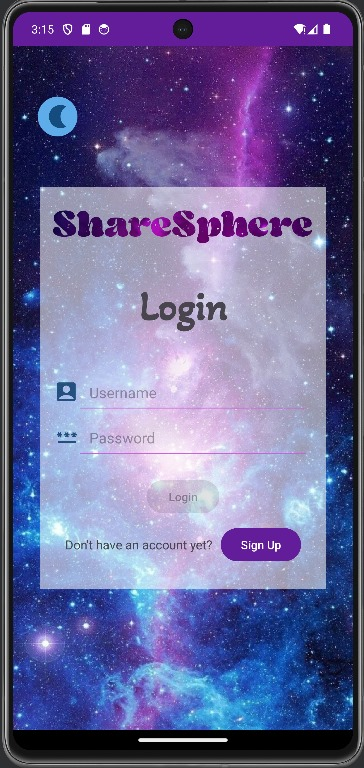
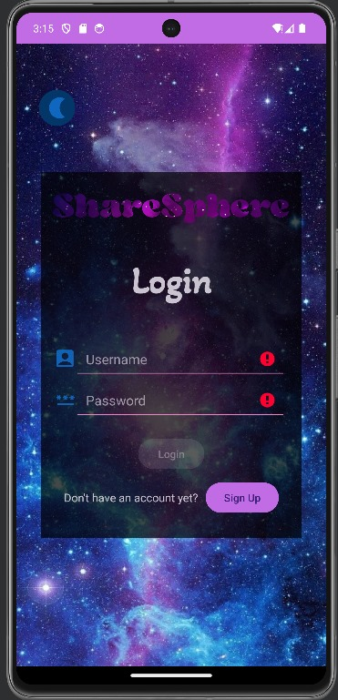
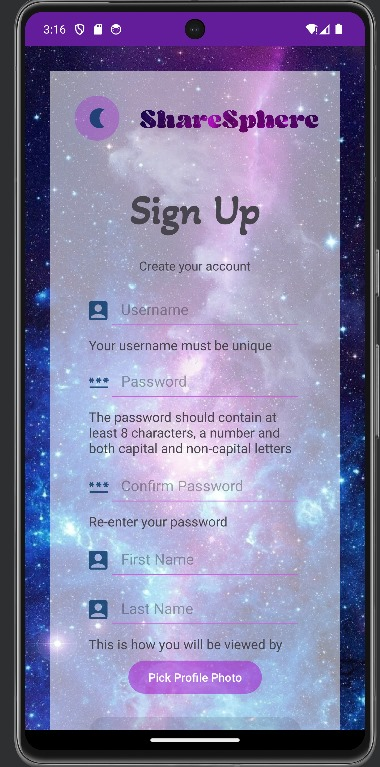
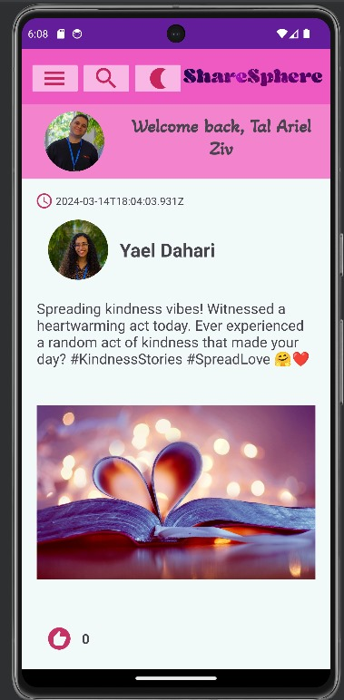
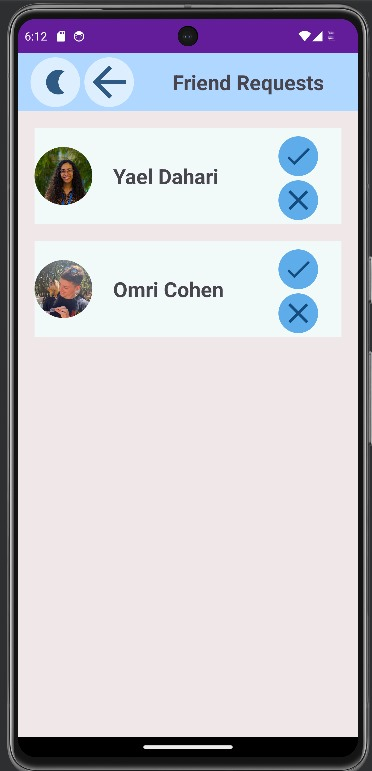
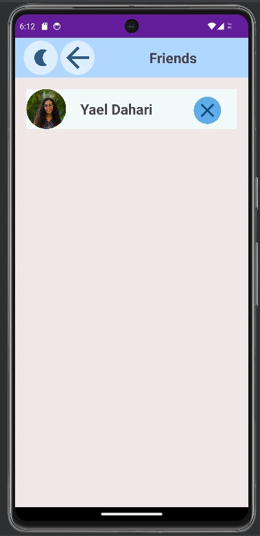
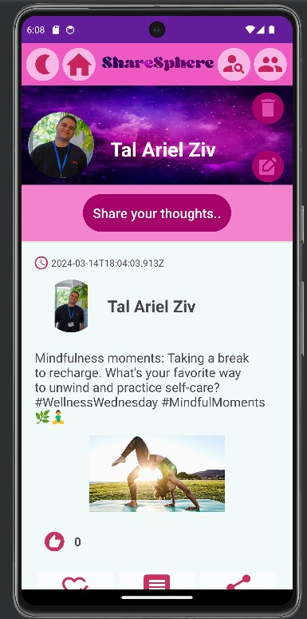
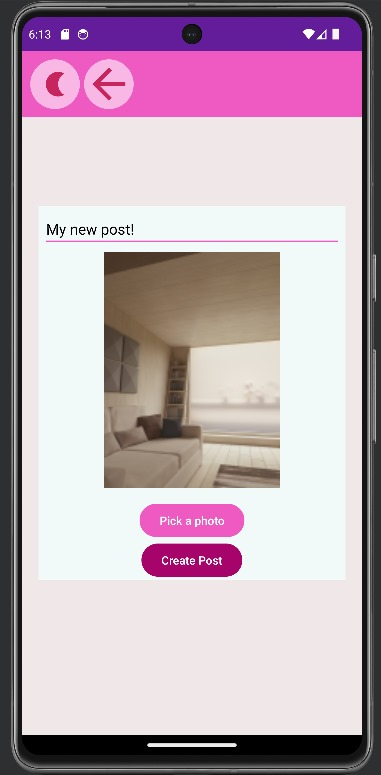
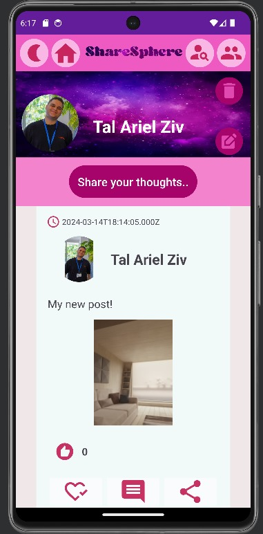
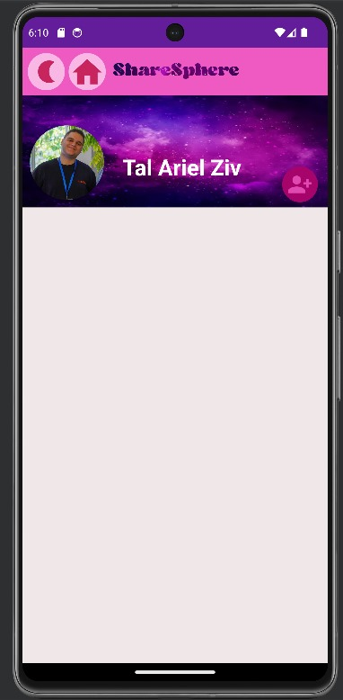

# [The Project's Wiki](https://github.com/Tal144155/Server/wiki)

# Share Sphere App

The Share Sphere App is a social media platform that allows users to share posts and interact with each other.
This README file provides an overview of the app's features and functionalities.
**Before running the app, please make sure the server is up and running!**

## Features
### Sign up
Log in with the user tal144155 (Password: tal2024) for an optimal experience, though any account will do.

### Feed
After logging in, users are redirected to the feed where they can view posts from other users.
Clicking on a profile picture redirects the user to the respective profile.

### Profile
Accessible by clicking on the profile picture.
Users can view their own posts and edit or delete them.
Also, on the profile page you can edit your profile, delete your account, watch your friends and friends requests.

### Editing and Deleting Posts
Editing and deleting posts can only be done through the user's profile, where only their posts are displayed.

### Log out
Logging out can be done through the menu, by clicking on the button below.

### Creating a Post
Creating a post can be done through the profile, by clicking twice on the text box labeled "Share your thoughts".
A user should upload a picture and write some content in order to create a post.

# Pictures from the app:
## Login:

## Login (dark mode):

## SignUp:

## Feed page:

## Approving friends request

## Watching friends

## Profile page (personal page)

## Creating new post

## Profile page (after adding post)

## Profile page (other user, not friend)

